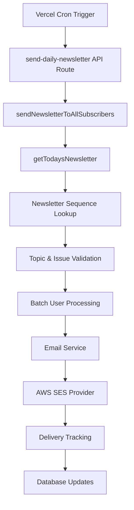
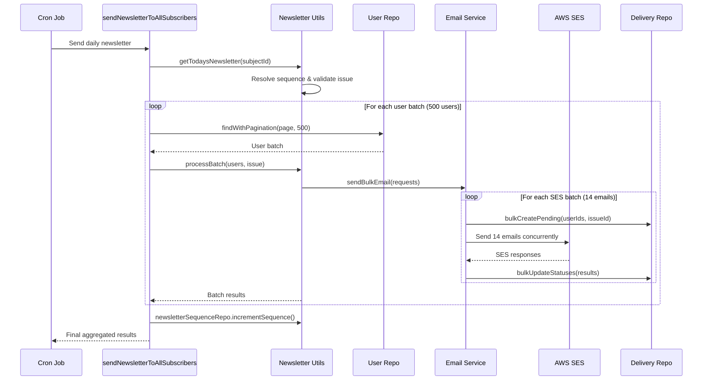

# Daily Newsletter Cron Job System Design

## Overview

The daily newsletter cron job system is responsible for automatically sending personalized newsletters to all subscribers on a daily basis. The system is designed for high reliability, scalability, and comprehensive delivery tracking.

## System Architecture

### High-Level Flow



## Core Components

### 1. Cron Job Entry Point

**File:** `src/app/api/cron/send-daily-newsletter/route.ts`

The entry point for the daily newsletter delivery system. This Next.js API route:

- **Authentication:** Validates Vercel cron secret via Authorization header
- **Orchestration:** Calls `sendNewsletterToAllSubscribers` with the System Design subject ID
- **Error Handling:** Comprehensive error categorization and HTTP response mapping
- **Logging:** Structured logging for monitoring and debugging

**Key Features:**
- Bearer token authentication using `CRON_SECRET` environment variable
- Specific error handling for `NOT_FOUND` and `PRECONDITION_FAILED` errors
- Detailed response objects with success/failure data

### 2. Newsletter Orchestration Layer

**File:** `src/server/newsletter/sendNewsletter.ts`

Contains the core orchestration logic:

#### `sendNewsletterToAllSubscribers(subjectId: number)`

**Purpose:** Main function that coordinates the entire newsletter delivery process

**Process Flow:**
1. **Newsletter Resolution:** Get today's newsletter via `getTodaysNewsletter()`
2. **Batch Processing:** Process users in configurable batches (500 users per DB query)
3. **Email Delivery:** Send emails in smaller batches (14 emails per batch for SES rate limits)
4. **Result Aggregation:** Collect and aggregate delivery results
5. **Sequence Update:** Increment newsletter sequence for next day

**Return Value:** `SendNewsletterToAllSubscribersResponse` with detailed metrics

### 3. Newsletter Resolution System

**File:** `src/server/newsletter/utils/newsletterUtils.ts`

#### `getTodaysNewsletter(subjectId: number)`

**Purpose:** Resolves which newsletter content to send based on current sequence

**Resolution Logic:**
1. Get or create newsletter sequence for subject
2. Find topic by subject ID and current sequence number
3. Find approved issue/newsletter for that topic
4. Validate issue can be sent (approved status, has content)

**Database Dependencies:**
- `newsletter_sequence` table for tracking current position
- `topics` table for content sequence
- `issues` table for newsletter content

### 4. Batch Processing System

#### User Batching Strategy

**DB Fetch Batches:** 500 users per database query (`BULK_EMAIL_CONSTANTS.DB_FETCH_SIZE`)
**Email Send Batches:** 14 emails per SES batch (`BULK_EMAIL_CONSTANTS.BATCH_SIZE`)

**Rationale:**
- DB batching reduces memory usage and database load
- Email batching respects AWS SES rate limits (14 emails/second)
- 1-second delay between email batches for rate limiting compliance

#### Batch Processing Flow

1. **User Pagination:** Fetch users in 500-user batches using `userRepo.findWithPagination()`
2. **Email Generation:** Create email requests for each user with personalized unsubscribe links
3. **SES Batching:** Process emails in 14-email batches within email service
4. **Delivery Tracking:** Create and update delivery records for each email
5. **Result Aggregation:** Collect batch results for final reporting

### 5. Email Service Layer

**File:** `src/server/email/emailService.ts`

#### `sendBulkEmail(request: BulkEmailSendRequest)`

**Multi-Level Batching:**
- Processes email requests in batches of 14 emails
- Creates pending delivery records before sending
- Sends emails concurrently using `Promise.allSettled()`
- Updates delivery records with results (sent/failed status)
- Handles partial batch failures gracefully

**Delivery Tracking Integration:**
- Creates `pending` delivery records before sending
- Updates records to `sent`/`failed` based on SES response
- Tracks external message IDs for SES correlation
- Logs errors for failed deliveries

### 6. AWS SES Provider

**File:** `src/server/email/providers/awsSes.ts`

#### Email Sending Methods

**Simple Send:** Uses `SendEmailCommand` for basic emails
**Raw Send:** Uses `SendRawEmailCommand` for emails with custom headers

**Custom Headers Support:**
- List-Unsubscribe header for compliance
- List-Unsubscribe-Post for one-click unsubscribe
- Custom tracking headers (planned via TODO)

**Authentication:**
- Uses AWS SDK v3 with access key/secret authentication
- Configurable AWS region via environment variables

### 7. Delivery Tracking System

**File:** `src/server/db/repo/deliveryRepo.ts`

#### Database Schema

**Table:** `deliveries`
- `id` (UUID): Primary key
- `issueId` (Integer): Newsletter issue reference
- `userId` (UUID): User reference
- `status` (Enum): pending, sent, delivered, failed, bounced
- `externalId` (String): AWS SES message ID
- `errorMessage` (String): Error details for failed deliveries
- `sentAt` (Timestamp): When email was sent
- `deliveredAt` (Timestamp): When delivery was confirmed (future use)

#### Bulk Operations

**Bulk Create:** `bulkCreatePending()` creates pending records for batch
**Bulk Update:** `bulkUpdateStatuses()` uses SQL CASE statements for efficient updates

### 8. Newsletter Sequence Management

**File:** `src/server/db/repo/newsletterSequenceRepo.ts`

**Purpose:** Tracks which newsletter in the sequence should be sent next

**Schema:** `newsletter_sequence` table
- `subjectId`: Which subject/course (e.g., System Design)
- `currentSequence`: Current position in newsletter sequence
- `lastSentAt`: When last newsletter was sent

**Operations:**
- `getOrCreate()`: Get existing sequence or create starting at 1
- `incrementSequence()`: Move to next newsletter after successful send

## Configuration

### Environment Variables

```bash
# AWS SES Configuration
AWS_REGION=us-east-1
AWS_ACCESS_KEY_ID=<access_key>
AWS_SECRET_ACCESS_KEY=<secret_key>
AWS_SES_FROM_EMAIL=<from_email>

# Authentication
CRON_SECRET=<vercel_cron_secret>
ADMIN_EMAIL=<admin_email>

# System Configuration
SYSTEM_DESIGN_SUBJECT_ID=1
```

### Rate Limiting Constants

**File:** `src/server/email/constants/bulkEmailConstants.ts`

```typescript
export const BULK_EMAIL_CONSTANTS = {
  BATCH_SIZE: 14,              // Emails per SES batch
  DB_FETCH_SIZE: 500,          // Users per DB query
  RATE_LIMIT_PER_SECOND: 14,   // AWS SES rate limit
  DELAY_BETWEEN_BATCHES: 1000, // 1 second delay
  MAX_RETRIES: 3,              // Retry failed batches (unused)
}
```

## Data Flow Diagram



## Error Handling

### Current Error Handling Patterns

#### 1. Cron Job Level (`route.ts`)
- **Authentication Errors:** 401 Unauthorized for invalid cron secret
- **NOT_FOUND Errors:** 404 when newsletter/topic not found
- **PRECONDITION_FAILED Errors:** 400 for validation failures
- **General Errors:** 500 for all other failures

#### 2. Service Level (`sendNewsletter.ts`)
- **Graceful Degradation:** Returns success=false with error details
- **Partial Failures:** Continues processing even if individual batches fail
- **Result Aggregation:** Collects all failures for reporting

#### 3. Email Service Level (`emailService.ts`)
- **Promise.allSettled:** Handles individual email failures without stopping batch
- **Delivery Tracking:** Updates failure status in database
- **Batch Isolation:** Failed batches don't affect other batches

#### 4. Provider Level (`awsSes.ts`)
- **Exception Handling:** Catches AWS SDK errors
- **Status Mapping:** Maps AWS responses to delivery status
- **Fallback Responses:** Returns failed status for caught exceptions

### Error Handling Gaps & Improvements

#### Current TODOs Related to Error Handling

1. **Email Service Delivery Tracking (`emailService.ts`):**
   ```typescript
   //TODO: create delivery status (line 22)
   //TODO: update delivery status (line 24)
   //TODO: update delivery status to failed if exists (line 26)
   ```

2. **AWS SES Response Processing (`awsSes.ts`):**
   ```typescript
   //TODO: IMPORTANT, we need to update status based on response status from send (line 61)
   ```

3. **Batch Error Handling Decision (`newsletterUtils.ts`):**
   ```typescript
   //TODO: figure out if updating deliver repo here is a good idea for error handling (line 136)
   ```

#### Identified Error Handling Improvements

1. **Missing Circuit Breaker Pattern**
   - No protection against cascading failures
   - Should implement circuit breaker for AWS SES calls

2. **Limited Retry Logic**
   - No automatic retries for transient failures
   - Should implement exponential backoff for failed emails

3. **Inadequate Monitoring Integration**
   - No structured metrics for error rates
   - Missing alerting for high failure rates

4. **Incomplete Delivery Status Tracking**
   - Delivery records not consistently created before sending
   - Status updates not atomic with email sending

5. **Error Context Loss**
   - Generic error messages without context
   - No correlation IDs for tracing failures

## Performance Characteristics

### Throughput Analysis

**Theoretical Maximum:**
- 14 emails/second (AWS SES rate limit)
- 50,400 emails/hour
- 1,209,600 emails/day

**Current Implementation:**
- 1-second delay between batches reduces effective rate
- ~7 emails/second average throughput
- Can handle ~25,000 users efficiently

### Memory Usage

**User Batching:** 500 users per batch limits memory usage
**Email Generation:** Minimal memory footprint per email
**Concurrent Processing:** 14 concurrent SES calls maximum

### Database Load

**Read Operations:**
- User pagination queries (500 users per query)
- Newsletter resolution queries (minimal)

**Write Operations:**
- Bulk delivery record creation (efficient batch inserts)
- Bulk status updates (efficient SQL CASE statements)

## Monitoring & Observability

### Current Logging

**Console Logging:**
- Batch processing progress
- Email sending results
- Error details with context

**Structured Data:**
- Total sent/failed counts
- Failed user IDs
- Processing time metrics

### Missing Monitoring

1. **Metrics Collection**
   - Delivery success rates
   - Processing time distributions
   - Error categorization

2. **Alerting**
   - High failure rate alerts
   - Processing time anomalies
   - AWS SES quota warnings

3. **Dashboards**
   - Real-time delivery status
   - Historical trend analysis
   - Performance metrics

## Security Considerations

### Authentication & Authorization

**Cron Job Security:**
- Bearer token authentication
- Environment variable for secret storage
- No public endpoint exposure

**Email Security:**
- Unsubscribe token generation with JWT
- User-specific unsubscribe URLs
- One-click unsubscribe compliance

### Data Protection

**PII Handling:**
- Minimal user data in email requests
- No persistent logging of email addresses
- Secure AWS credentials management

## Future Enhancements (TODOs)

### Email Delivery Improvements

```typescript
// TODO: Implement delivery tracking webhooks
// TODO: Add bounce and complaint handling  
// TODO: Create SES configuration sets for detailed metrics
// TODO: Implement email engagement tracking (opens, clicks)
// TODO: Add userId and issueId correlation for analytics
```

### Subscription Management

```typescript
// TODO: Add subscription status filtering
// TODO: Implement subscription preferences (frequency, topics)
// TODO: Add subscription pause/resume functionality
// TODO: Create subscription analytics dashboard
```

### Advanced Features

```typescript
// TODO: A/B testing for subject lines and content
// TODO: Dynamic content personalization based on user data
// TODO: Send time optimization based on user timezone
// TODO: Automated re-engagement campaigns for inactive users
```

### Scalability Improvements

```typescript
// TODO: Implement Redis-based job queue for larger scale
// TODO: Add horizontal scaling with multiple workers
// TODO: Implement circuit breakers for external service failures
// TODO: Add comprehensive metrics and alerting system
```

### Unsubscribe System Integration

```typescript
// TODO: Mark user as inactive in database (multiple locations)
```

### Content Validation

```typescript
// TODO: add more validation here (newsletter generation)
// TODO: add response format (LLM integration)
```

## Deployment & Operations

### Vercel Cron Configuration

**Schedule:** Daily execution (configured in `vercel.json`)
**Timeout:** Default Vercel function timeout
**Region:** Matches application deployment region

### Database Migrations

**Required Tables:**
- `newsletter_sequence`
- `deliveries`
- `users`
- `issues`
- `topics`
- `subjects`

### AWS SES Setup

**Domain Verification:** Required for from address
**Rate Limits:** Default 14 emails/second (can request increase)
**Region Configuration:** Must match application region

## Troubleshooting Guide

### Common Issues

1. **"Newsletter not found" Errors**
   - Check newsletter sequence table
   - Verify topic exists for current sequence
   - Ensure issue is approved and has content

2. **AWS SES Authentication Failures**
   - Verify AWS credentials in environment
   - Check IAM permissions for SES
   - Validate AWS region configuration

3. **High Failure Rates**
   - Check AWS SES quotas and limits
   - Verify from email domain verification
   - Review bounce and complaint rates

4. **Performance Issues**
   - Monitor database query performance
   - Check AWS SES rate limiting
   - Review batch size configurations

### Debugging Steps

1. **Check Cron Job Logs:** Vercel function logs for entry point errors
2. **Review Email Service Logs:** Detailed batch processing information
3. **Query Delivery Records:** Database records for delivery status
4. **AWS SES Console:** SES-specific metrics and errors
5. **Database Performance:** Query execution times and locks

## Conclusion

The daily newsletter cron job system provides a robust foundation for automated email delivery with comprehensive tracking and error handling. The multi-layered architecture ensures reliability while maintaining good performance characteristics.

Key strengths include:
- Efficient batch processing respecting rate limits
- Comprehensive delivery tracking
- Graceful error handling and partial failure recovery
- Scalable architecture supporting growth

Areas for improvement focus on enhanced monitoring, retry logic, and advanced delivery features as outlined in the TODO sections.
