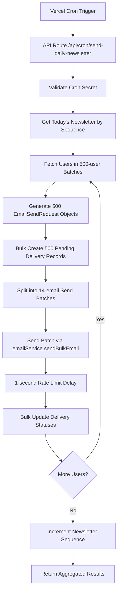

# Newsletter Cron Delivery System Architecture

## Overview
The Newsletter Cron Delivery System is a comprehensive solution for automatically sending daily newsletters to all subscribers using Vercel Cron jobs. The system handles batch processing, rate limiting, delivery tracking, and error resilience while respecting AWS SES sending limits.

## Core Components

### 1. Vercel Cron Job Entry Point
- **Route**: `/api/cron/send-daily-newsletter`
- **Authentication**: Vercel cron secret header validation
- **Trigger**: Daily at 9:00 AM PT (configurable)
- **Purpose**: Secure entry point for automated newsletter delivery

### 2. Newsletter Delivery Service
- **File**: `src/server/newsletter/sendNewsletter.ts`
- **Function**: `sendNewsletterToAllSubscribers()`
- **Purpose**: Orchestrates the entire newsletter delivery process
- **Batch Size**: 500 users per database query, 14 emails per send batch

### 3. Email Generation Pipeline
- **Content**: Newsletter HTML/text templates with unsubscribe links
- **Headers**: List-Unsubscribe headers for compliance
- **Personalization**: User-specific unsubscribe URLs and tracking
- **Templates**: Reuse existing newsletter template system

### 4. Delivery Tracking System
- **Database**: `deliveries` table for full audit trail
- **Statuses**: `pending` → `sent`/`failed` → `delivered`/`bounced`
- **Bulk Operations**: Efficient batch create and update operations
- **Error Logging**: Detailed error messages and external IDs

### 5. Rate Limiting & Batch Processing
- **AWS SES Limit**: 14 emails per second
- **Batch Strategy**: Process 500 users at a time from database
- **Send Batches**: 14 emails per send operation with 1-second delays
- **Memory Efficiency**: Process users in chunks to avoid memory issues

## Data Flow Architecture



## Database Schema Integration

### Newsletter Sequence Tracking
```sql
-- Current sequence for each subject (System Design = 1)
newsletter_sequence {
  subject_id: integer,
  current_sequence: integer,    -- Today's newsletter number
  last_sent_at: timestamp,      -- Last successful send
}
```

### Delivery Tracking
```sql
-- Individual email delivery records
deliveries {
  id: uuid,
  issue_id: integer,           -- References issues.id
  user_id: uuid,               -- References users.id  
  status: delivery_status,     -- pending, sent, failed, bounced, delivered
  external_id: text,           -- AWS SES message ID
  error_message: text,         -- Error details if failed
  created_at: timestamp,       -- When delivery was initiated
  sent_at: timestamp,          -- When email was sent
  delivered_at: timestamp      -- When delivery was confirmed
}
```

## Implementation Details

### 1. Newsletter Sequence Logic
```typescript
// Get today's newsletter by current sequence
async function getTodaysNewsletter(subjectId: number) {
  const sequence = await newsletterSequenceRepo.getOrCreate(subjectId);
  const issue = await issueRepo.findByTopicSequence(subjectId, sequence.currentSequence);
  
  if (!issue || issue.status !== 'approved') {
    throw new Error(`No approved newsletter for sequence ${sequence.currentSequence}`);
  }
  
  return { issue, sequence };
}
```

### 2. Batch Processing Strategy
```typescript
// Process all users in manageable batches
async function processUserBatches(issue: Issue) {
  const DB_FETCH_SIZE = 500;
  const results = { totalSent: 0, totalFailed: 0, failedUserIds: [] };
  let offset = 0;
  
  while (true) {
    const users = await userRepo.findAllInBatches(DB_FETCH_SIZE, offset);
    if (users.length === 0) break;
    
    const batchResults = await processBatch(users, issue);
    aggregateResults(results, batchResults);
    
    offset += DB_FETCH_SIZE;
  }
  
  return results;
}
```

### 3. Email Request Generation
```typescript
// Generate personalized email requests for batch
async function generateEmailSendRequests(users: User[], issue: Issue) {
  return users.map(user => ({
    to: user.email,
    subject: issue.title,
    html: createNewsletterHtml({
      title: issue.title,
      content: issue.content,
      topicId: issue.topicId,
      unsubscribeUrl: generateUnsubscribePageUrl(user.id, user.email)
    }),
    text: createNewsletterText({...}),
    headers: generateHeaders(user.id, issue.id),
    userId: user.id
  }));
}
```

### 4. Delivery Record Management
```typescript
// Bulk create pending delivery records
await deliveryRepo.bulkCreatePending(
  users.map(user => ({ 
    issueId: issue.id, 
    userId: user.id, 
    status: 'pending' 
  }))
);

// Bulk update delivery statuses after sending
await deliveryRepo.bulkUpdateStatuses(
  emailResults.map((result, index) => ({
    userId: users[index].id,
    issueId: issue.id,
    status: result.status,
    externalId: result.messageId,
    errorMessage: result.error,
    sentAt: result.status === 'sent' ? new Date() : undefined
  }))
);
```

### 5. Rate Limiting Implementation
```typescript
// Send in batches of 14 with 1-second delays
const BATCH_SIZE = 14;
for (let i = 0; i < emailRequests.length; i += BATCH_SIZE) {
  const batch = emailRequests.slice(i, i + BATCH_SIZE);
  
  const bulkRequest: BulkEmailSendRequest = {
    entries: batch,
    from: env.AWS_SES_FROM_EMAIL
  };
  
  const results = await emailService.sendBulkEmail(bulkRequest);
  
  // Update delivery records based on results
  await updateDeliveryRecords(batch, results);
  
  // Rate limiting delay (except for last batch)
  if (i + BATCH_SIZE < emailRequests.length) {
    await delay(1000);
  }
}
```

## API Endpoint Specification

### Request
```http
POST /api/cron/send-daily-newsletter
Authorization: Bearer <VERCEL_CRON_SECRET>
Content-Type: application/json
```

### Response
```typescript
{
  success: boolean;
  totalSent: number;
  totalFailed: number;
  failedUserIds: string[];
  issueId: number;
  sequenceNumber: number;
  processedUsers: number;
  deliveryRecordsCreated: number;
  error?: string;
}
```

## Error Handling Strategy

### 1. Newsletter Not Found
- **Scenario**: No approved newsletter for current sequence
- **Action**: Return error, don't increment sequence
- **Recovery**: Admin must approve newsletter manually

### 2. Partial Batch Failures
- **Scenario**: Some emails in batch fail to send
- **Action**: Continue processing remaining batches
- **Tracking**: Record failed userIds in delivery records

### 3. Complete System Failure
- **Scenario**: Database connection lost, AWS SES unavailable
- **Action**: Return error response, log details
- **Recovery**: Cron job will retry on next scheduled run

### 4. Rate Limiting Exceeded
- **Scenario**: AWS SES rate limits hit
- **Action**: Built-in delays prevent this scenario
- **Fallback**: exponential backoff in email provider

## Security Considerations

### 1. Cron Authentication
- **Method**: Vercel cron secret header validation
- **Header**: `Authorization: Bearer <VERCEL_CRON_SECRET>`
- **Validation**: Compare against environment variable

### 2. Unsubscribe Security  
- **URLs**: Signed URLs with expiration
- **Validation**: JWT token validation on unsubscribe
- **Compliance**: Both one-click and page-based unsubscribe

### 3. Email Content Security
- **Templates**: Server-side rendering only
- **Sanitization**: All user content properly escaped
- **Headers**: Standard email security headers

## Performance Optimizations

### 1. Database Efficiency
- **Batch Queries**: Fetch 500 users per query
- **Bulk Operations**: Create/update delivery records in batches
- **Indexes**: Proper indexing on user queries and delivery lookups

### 2. Memory Management
- **Streaming**: Process users in chunks, not all at once
- **Garbage Collection**: Clear processed batches from memory
- **Limits**: Configurable batch sizes via constants

### 3. Email Delivery
- **Parallel Processing**: Send 14 emails concurrently per batch
- **Rate Limiting**: Respect AWS SES limits exactly
- **Connection Reuse**: Efficient HTTP client configuration

## Monitoring & Observability

### 1. Delivery Metrics
- **Success Rate**: Percentage of successful deliveries
- **Bounce Rate**: Tracking email bounces and complaints
- **Processing Time**: Total time to send to all users
- **Batch Statistics**: Performance per user batch

### 2. Error Tracking
- **Failed Deliveries**: Count and reasons for failures
- **System Errors**: Database, network, or service failures
- **Rate Limiting**: Monitoring for rate limit approaches

### 3. Business Metrics
- **Daily Send Volume**: Number of newsletters sent daily
- **User Growth Impact**: Delivery scaling with user base
- **Sequence Progress**: Newsletter sequence advancement tracking

## Future Enhancements (TODOs)

### 1. Advanced AWS SES Integration
```typescript
// TODO: Implement delivery tracking webhooks
// TODO: Add bounce and complaint handling
// TODO: Create SES configuration sets for detailed metrics
// TODO: Implement email engagement tracking (opens, clicks)
// TODO: Add userId and issueId correlation for analytics
```

### 2. Subscription Management
```typescript
// TODO: Add subscription status filtering
// TODO: Implement subscription preferences (frequency, topics)
// TODO: Add subscription pause/resume functionality
// TODO: Create subscription analytics dashboard
```

### 3. Advanced Features
```typescript
// TODO: A/B testing for subject lines and content
// TODO: Dynamic content personalization based on user data
// TODO: Send time optimization based on user timezone
// TODO: Automated re-engagement campaigns for inactive users
```

### 4. Infrastructure Scaling
```typescript
// TODO: Implement Redis-based job queue for larger scale
// TODO: Add horizontal scaling with multiple workers  
// TODO: Implement circuit breakers for external service failures
// TODO: Add comprehensive metrics and alerting system
```

## Environment Configuration

### Required Environment Variables
```bash
# Existing variables
DATABASE_URL="postgresql://..."
AWS_SES_FROM_EMAIL="newsletter@yourdomain.com"
REDIS_URL="redis://..."

# New variables for cron delivery
VERCEL_CRON_SECRET="your-secure-cron-secret"
```

### Vercel Cron Configuration
```json
// vercel.json
{
  "crons": [
    {
      "path": "/api/cron/send-daily-newsletter",
      "schedule": "0 16 * * *"  // 9:00 AM PT (UTC-8) = 16:00 UTC
    }
  ]
}
```

This architecture provides a robust, scalable foundation for automated newsletter delivery that can handle thousands of subscribers while maintaining delivery reliability and comprehensive tracking.